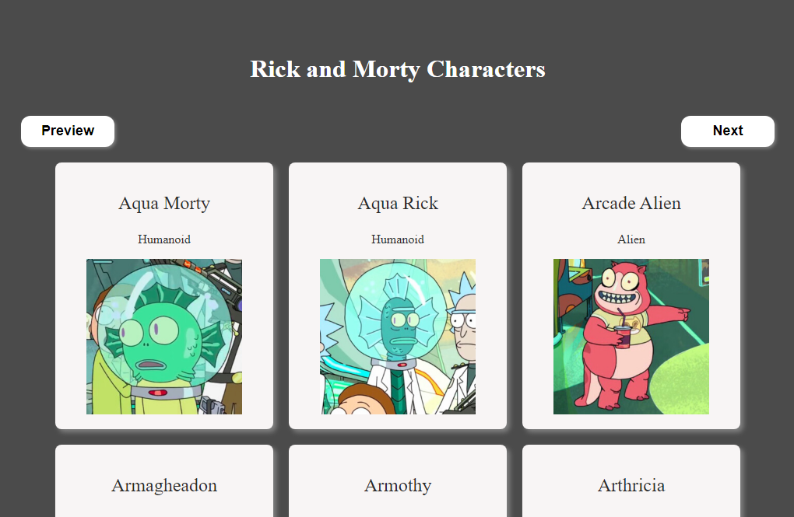
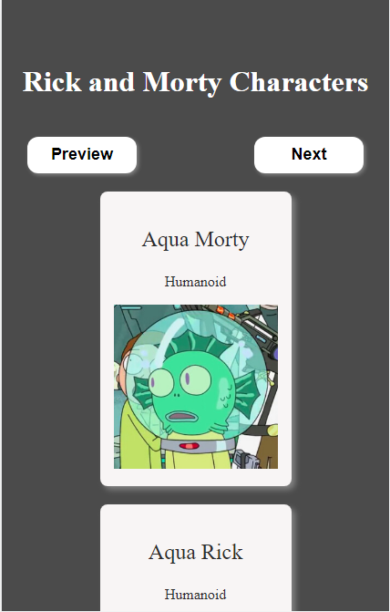

# App para visualizar los personajes de la serie Rick and Morty

 - [Accede a la app aqui!](https://app-rick-and-morty-graphql.netlify.app/)

 

#### La api que usé fue https://rickandmortyapi.com/graphql

 

## Imagenes de muestra de la App
<figure>
    <figcaption>Vista Desktop</figcaption>
    
</figure>  
<figure>
    <figcaption>Vista Mobile</figcaption>
    
</figure>  

#### Esta aplicación la realicé usando:
- HTML
- Javascript
- CSS
- React
- GraphQL